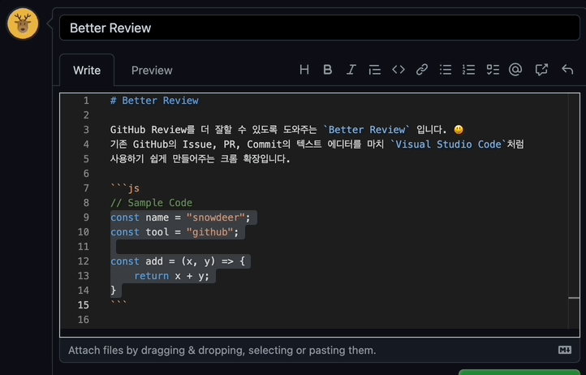

# better-review

GitHub Review를 더 잘할 수 있도록 도와주는 `Better Review` 입니다.

기존 GitHub의 Issue, PR, Commit의 텍스트 에디터를 마치 `Visual Studio Code`처럼  
사용하기 쉽게 만들어주는 크롬 확장입니다.  
(실제로 `VSCode`에서 사용하는 Monaco Editor 기반으로 되어 있습니다.)

Samsung GitHub Enterprise에서도 사용가능합니다.

## 실행 화면

### 기본 GitHub 에디터

### Better Review 적용

### Dark Theme

Theme는 GitHub의 `Settings` > `Appearance`에서 선택한 테마를 따라갑니다.  
단, `Single theme`만 지원합니다. (`Sync with system`의 `Day theme`, `Night theme`는 동작안합니다.)

## 주요기능

주요기능은 다음과 같습니다.

### <kbd>Tab</kbd> 키를 이용한 Indent

### 멀티 셀렉션

### 더 많은 이모지 추천

